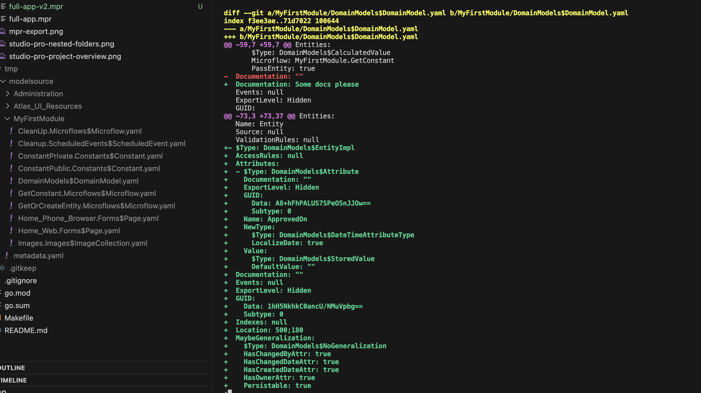
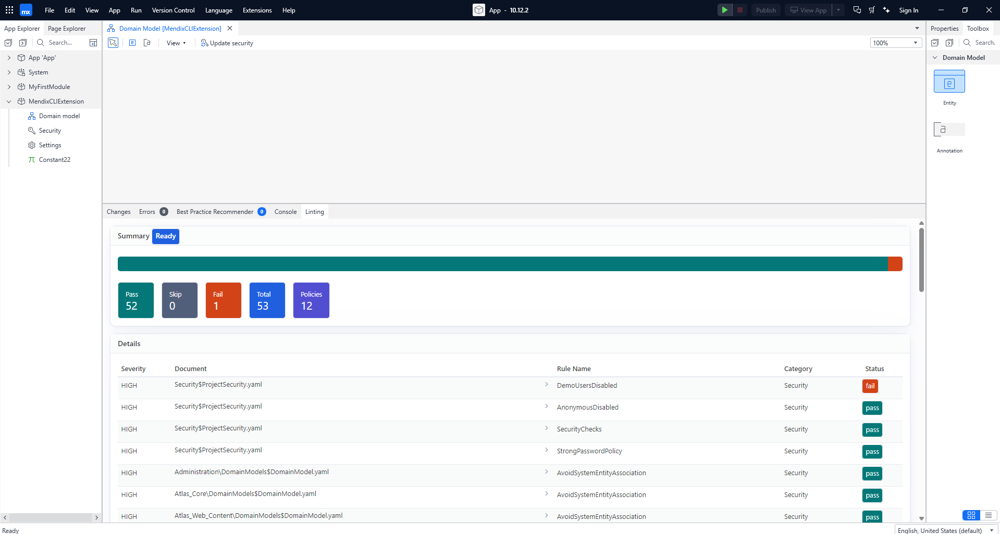
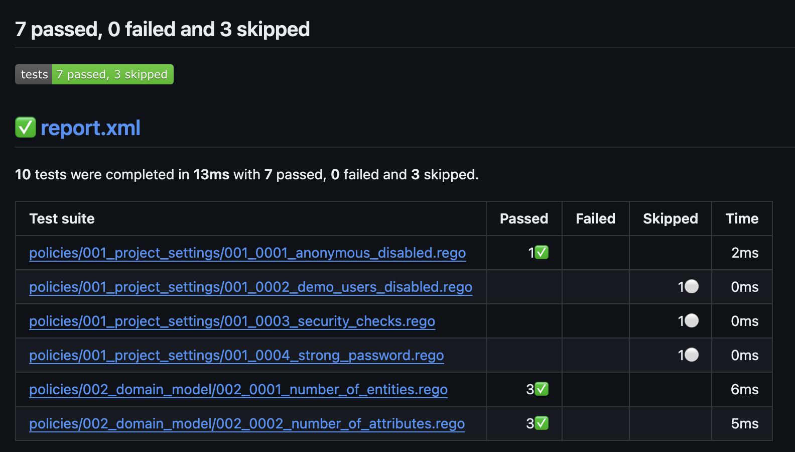

# Use cases

Here we attempt to show you what you can accomplish with MxLint. It has many purposes thanks to the fact is works lightning fast and versatile.

## Textual revision diff-ing

To compare model changes normally you need Mendix Studio Pro. With MxLint you can use any existing Merge request workflow to review model changes. Albeit in a textual instead of visual way:

Above use case is best when using the [extension with your project in Mendix Studio Pro](mendix-studio-pro-extension/index.md)

## Get feedback on best practices in Studio Pro

With the new recent extensibility support in Mendix Studio pro, MxLint is closer than ever to you. With the extension, you get almost real-time feedback on your project quality. It does not use AI or LLM but old-school, objective and deterministic rules.

[Start here with the extension](mendix-studio-pro-extension/index.md)

## Enforce best practices in pipelines

In order to guard quality and maintainability of Mendix apps as a platform owner, you can build quality gates into your pipelines. This way you ensure minimum quality criterias are met as part of you CI/CD workflows.

[Learn how this works in pipelines](pipeline-integration/index.md)

## Organizational custom best practices

As MxLint is Open source, the possibilities are endless. This means you are free and able to write your own [custom rules](rules/create.md). 

## Others

Do you use MxLint in other ways? Let us know.